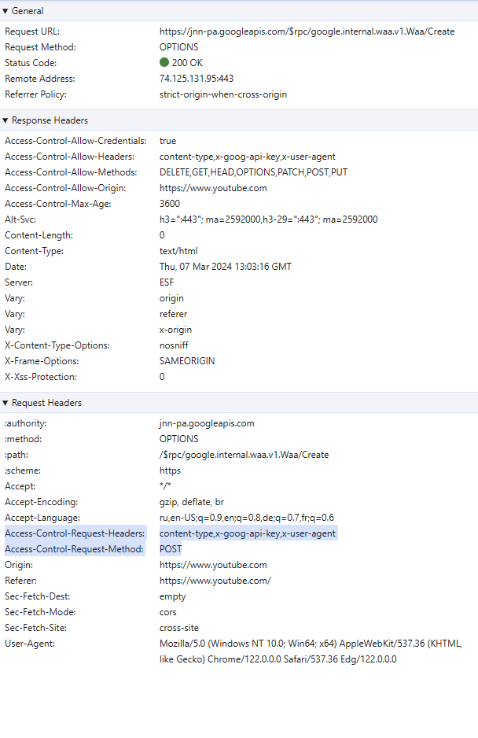
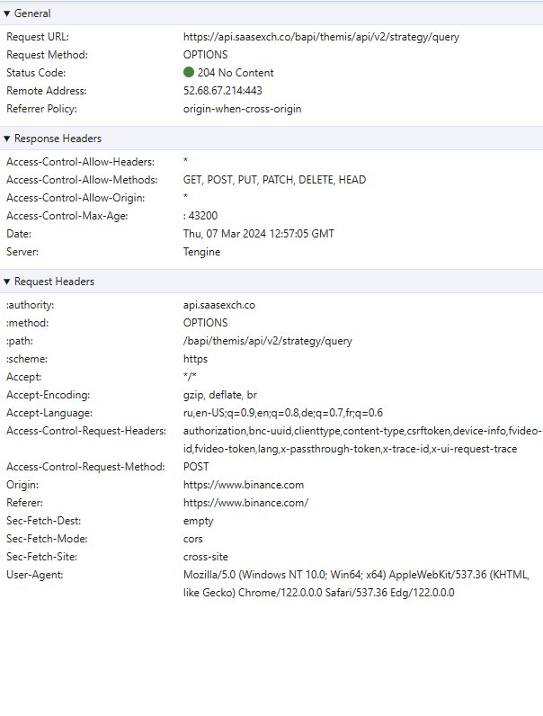

# Cross-Origin Resource Sharing (CORS)

Протокол **CORS** существует чтобы разрешать обмен ответами из разных источников. Протокол **CORS** накладывается поверх HTTP и позволяет ответам объявлять, что они могут быть переданы другим источникам.

Протокол **CORS** состоит из набора заголовков, которые указывают, может ли ответ быть общим для разных источников.

Именно user agent отвечает за успешность **CORS** соединения. То есть, он вместе с запросом пересылает заголовок `Origin` и, уже исходя из значений в полях ответа, которые отвечают за **CORS**, например `Access-Control-Allow-Origin` решает успешный ли CORS запрос или нет.
Подробнее примеры можно найти здесь: https://fetch.spec.whatwg.org/#cors-protocol-examples

Методы, которые считаются безопасными для **CORS**: `GET`, `HEAD`, or `POST`.

## Request

**CORS request (запрос CORS)** — это HTTP-запрос, который включает заголовок `Origin`.

**CORS-preflight request (предварительный/предполетный запрос CORS)** — это запрос CORS (**CORS request**), который проверяет, понятен ли протокол **CORS**. Он использует `OPTIONS` в качестве метода и включает следующие поля

### [Access-Control-Request-Method](https://fetch.spec.whatwg.org/#http-access-control-request-method) 🎩➡️

**`Access-Control-Request-Method`** - обязательное поле для **CORS-preflight request**, которое указывает, какой метод может использовать будущий запрос CORS к тому же ресурсу.

### [Access-Control-Request-Headers](https://fetch.spec.whatwg.org/#http-access-control-request-method) 🎩➡️

**`Access-Control-Request-Headers`** - необязательное поле для **CORS-preflight request**, которое указывает, какие заголовки может использовать будущий запрос CORS к тому же ресурсу.

Примеры CORS-preflight request

___

### [CORS-safelisted request header](https://fetch.spec.whatwg.org/#cors-safelisted-request-header)

Список полей заголовков, которые считаются безопасными при **CORS**. У этих полей есть ограничение, [подробнее тут](https://fetch.spec.whatwg.org/#cors-safelisted-request-header).

- [`Accept`](https://www.rfc-editor.org/rfc/rfc9110#section-12.5.1)
- [`Accept-Language`](https://www.rfc-editor.org/rfc/rfc9110#section-12.5.4)
- [`Content-Language`](https://www.rfc-editor.org/rfc/rfc9110#section-8.5)
- [`Content-Type`](https://www.rfc-editor.org/rfc/rfc9110#section-8.3)
- [`Range`](https://www.rfc-editor.org/rfc/rfc9110#section-14.2)

### [no-CORS-safelisted request-header name](https://fetch.spec.whatwg.org/#no-cors-safelisted-request-header-name)

- [`Accept`](https://www.rfc-editor.org/rfc/rfc9110#section-12.5.1)
- [`Accept-Language`](https://www.rfc-editor.org/rfc/rfc9110#section-12.5.4)
- [`Content-Language`](https://www.rfc-editor.org/rfc/rfc9110#section-8.5)
- [`Content-Type`](https://www.rfc-editor.org/rfc/rfc9110#section-8.3)

## Response

### Response to CORS request

HTTP-ответ на запрос CORS (**CORS request**) может содержать следующие поля.

#### [Access-Control-Allow-Origin](https://fetch.spec.whatwg.org/#http-access-control-allow-origin)
**`Access-Control-Allow-Origin`** - это обязательное поле, которое указывает, можно ли поделиться ответом, возвращая буквальное значение заголовка запроса `Origin` (который может иметь значение null) или `*` в ответе.

#### [Access-Control-Allow-Credentials](https://fetch.spec.whatwg.org/#http-access-control-allow-credentials)
**`Access-Control-Allow-Credentials`** - это обязательное поле, которое указывает, можно ли поделиться ответом, если у запроса стоит режим учетных данных ([**credentials mode**](https://fetch.spec.whatwg.org/#concept-request-credentials-mode)) - "include".

#### [Access-Control-Expose-Headers](https://fetch.spec.whatwg.org/#http-access-control-expose-headers) 🎩⬅️
**`Access-Control-Expose-Headers`** - это необязательное поле, которое указывает, какие заголовки могут быть представлены как часть ответа, перечисляя их имена, тем самым расширяя список **CORS-safelisted response-header name**, который представлен ниже.

Успешный HTTP-ответ, т.е. ответ, которым разработчик сервера намеревается поделиться, на запрос CORS может использовать любой статус, если он включает указанные выше заголовки со значениями, совпадающими с запросом.

### Response to CORS preflight request

HTTP-ответ на предварительный запрос CORS (**CORS-preflight request**) может содержать следующие заголовки:

#### [Access-Control-Allow-Methods](https://fetch.spec.whatwg.org/#http-access-control-allow-methods) 🎩⬅️
**`Access-Control-Allow-Methods`** - это поле указывает, какие методы поддерживаются URL-адресом ответа для целей протокола **CORS**. Заголовок `Allow`, который должен возвращать сервер на запрос с методом `OPTIONS`, не имеет отношения к целям **протокола CORS**.

#### [Access-Control-Allow-Headers](https://fetch.spec.whatwg.org/#http-access-control-allow-headers) 🎩⬅️
**`Access-Control-Allow-Headers`** - это поле указывает, какие заголовки поддерживаются URL-адресом ответа для целей протокола CORS.

#### [Access-Control-Max-Age](https://fetch.spec.whatwg.org/#http-access-control-max-age) 🎩⬅️
**`Access-Control-Max-Age`** - это поле указывает количество секунд (по умолчанию 5), в течение которых информация, предоставляемая заголовками `Access-Control-Allow-Methods` и `Access-Control-Allow-Headers`, может быть кэширована.

Успешный ответ HTTP на предварительный запрос CORS аналогичен успешному ответу на CORS запрос (описано выше), за исключением того, что он ограничен статусом «ОК», например, 200 или 204.

### [CORS-safelisted response-header name](https://fetch.spec.whatwg.org/#cors-safelisted-response-header-name)

- [`Cache-Control`](https://www.rfc-editor.org/rfc/rfc9111#name-cache-control)
- [`Content-Language`](https://www.rfc-editor.org/rfc/rfc9110#section-8.5)
- [`Content-Length`](https://www.rfc-editor.org/rfc/rfc9110#name-content-length)
- [`Content-Type`](https://www.rfc-editor.org/rfc/rfc9110#section-8.3)
- [`Expires`](https://www.rfc-editor.org/rfc/rfc9111#name-expires)
- [`Last-Modified`](https://www.rfc-editor.org/rfc/rfc9110.html#name-last-modified)
- [`Pragma`](https://www.rfc-editor.org/rfc/rfc9111#name-pragma)
- Любое другое поле, за исключением **forbidden response-header name**

## Credentials

Делая **CORS** user agent будет передавать с ответом поля `Set-Cookie`, только если с запросом была передана инструкция `credentials: "include"` и ответ на этот запрос удовлетворяет все условия, чтобы считаться успешным. Подробнее: https://fetch.spec.whatwg.org/#cors-protocol-and-credentials
