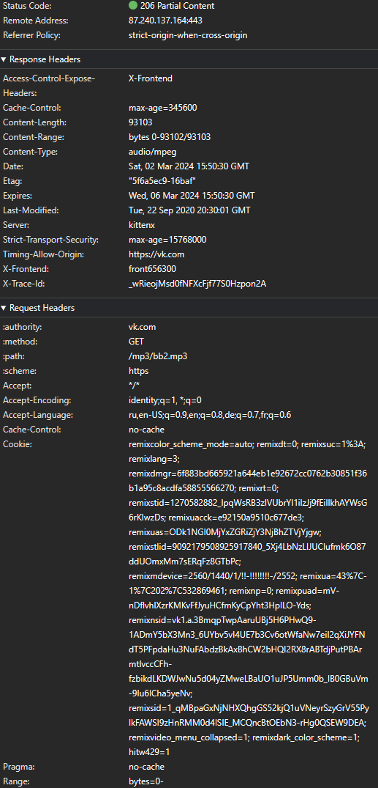
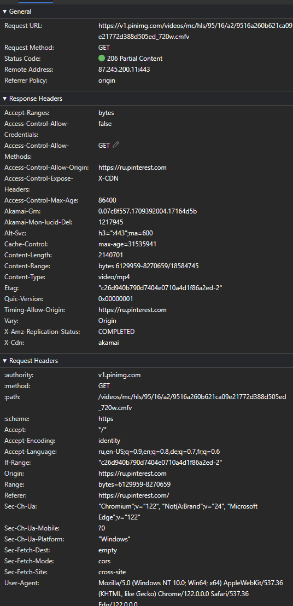
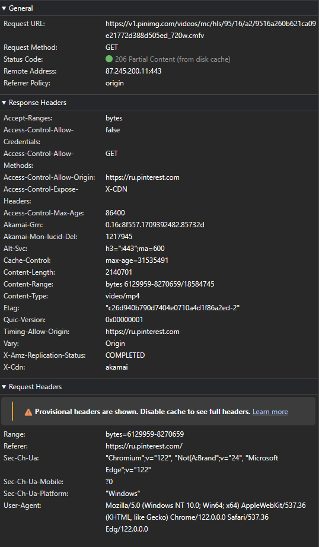

### [Partial Content (Range Requests)](https://www.rfc-editor.org/rfc/rfc9110.html#section-14)

**Partial Content** - это контент, данные представления (**representation data**), которого могут быть разделены на поддиапазоны (**subranges**), когда существуют адресуемые структурные единицы, присущие содержимому этих данных, кодировке или типу носителя. Например, границы октетов (также известных как байты) представляют собой структурную единицу, общую для всех данных представления, позволяющую идентифицировать разделы данных как диапазон байтов с некоторым смещением от начала или конца этих данных. То есть, чтобы контент считался "полным" представлением ресурса, и его можно было бы склеить кэшем в целый ответ, надо будет сделать удовлетворительное количество запросов к исходному серверу (**origin server**). Добиться диапазонными запросами (**range requests**).

**Range requests (диапазонные запросы)** — это ОПЦИОНАЛЬНАЯ функция HTTP, разработанная таким образом, чтобы получатели, не реализующие эту функцию (или не поддерживающие ее для целевого ресурса), могли отвечать, как если бы это был обычный запрос GET, не влияя на совместимость. Частичные ответы обозначаются отдельным кодом состояния ([206 Partial Content](https://www.rfc-editor.org/rfc/rfc9110.html#name-206-partial-content)), чтобы кэши, которые могут не реализовать эту функцию, не приняли их за полные ответы.

Диапазоны запросов выражаются в виде единицы диапазона (**range units**) в сочетании с набором спецификаторов диапазона (**range specifiers**). Имя единицы диапазона (**range unit**) определяет, какие типы спецификации диапазона применимы к ее собственным спецификаторам.

Полный список зарегистрированных диапазонных единиц: https://www.iana.org/assignments/http-parameters/http-parameters.xhtml#range-units

Единица диапазона (**range unit**) `bytes` используется для выражения поддиапазонов (subranges) последовательности октетов данных представления. Каждый диапазон байтов выражается в виде целочисленного (integer) диапазона с некоторым смещением относительно либо начала ([int-range](https://www.rfc-editor.org/rfc/rfc9110.html#rule.int-range)), либо конца ([suffix-range](https://www.rfc-editor.org/rfc/rfc9110.html#rule.suffix-range)) данных представления.

Значение [first-pos](https://www.rfc-editor.org/rfc/rfc9110.html#rule.int-range) в байтовом [int-range](https://www.rfc-editor.org/rfc/rfc9110.html#rule.int-range) дает смещение первого байта в диапазоне. Значение [last-pos](https://www.rfc-editor.org/rfc/rfc9110.html#rule.int-range) дает смещение последнего байта в диапазоне; то есть указанные позиции байтов являются инклюзивными. Смещения байтов начинаются с нуля.

## Fields

### [Range](https://www.rfc-editor.org/rfc/rfc9110.html#name-range) 🎩➡️

**Range** - это поле, которое [только в запросе `GET`](https://www.rfc-editor.org/rfc/rfc9110.html#section-14.2-4) изменяет семантику метода, запрашивая передачу только одного или нескольких поддиапазонов выбранных данных представления (**representation data**), а не всего выбранного представления. Сервер **МОЖЕТ (MAY)** игнорировать поле заголовка `Range`. Однако исходные серверы (**origin servers**) и промежуточные кэши должны поддерживать диапазоны байтов, когда это возможно, поскольку они поддерживают эффективное восстановление после частично неудачных передач и частичный поиск больших представлений.

### [Accept-Ranges](https://www.rfc-editor.org/rfc/rfc9110.html#name-accept-ranges) 🎩⬅️

**Accept-Ranges** - это поле указывает, поддерживает ли вышестоящий сервер (**upstream server**) диапазонные запросы (**range requests**) для целевого ресурса. Сервер который поддерживает запросы в байтовом диапазоне может отправить поле `Accept-Ranges: bytes`, а сервер, который не поддерживает может отправить поле `Accept-Ranges: none`

### [Content-Range](https://www.rfc-editor.org/rfc/rfc9110.html#name-content-range) 🎩⬅️

**Content-Range** - это поле, которое используется для указания частичного диапазона выбранного представления, заключенного в качестве содержимого сообщения, отправленного в каждой части составного ответа [206 (Partial Content)](https://www.rfc-editor.org/rfc/rfc9110.html#status.206) для указания диапазона, заключенного [в пределах каждую часть тела](https://www.rfc-editor.org/rfc/rfc9110.html#multipart.byteranges). Это поле отправляется как с статус кодом [206 (Partial Content)](https://www.rfc-editor.org/rfc/rfc9110.html#status.206), так и в ответах с кодом [416 (Range Not Satisfiable)](https://www.rfc-editor.org/rfc/rfc9110.html#status.416) для предоставления информации о выбранном представлении.

`Content-Range` также может быть отправлен как модификатор запроса для запроса [частичного PUT](https://www.rfc-editor.org/rfc/rfc9110.html#partial.PUT).

Пример с известной "полной" (complete) длиной контента: `Content-Range: bytes 42-1233/1234`
Пример с неизвестной "полной" (complete) длиной контента: `Content-Range: bytes 42-1233/*`

Сервер, генерирующий ответ [416 (Range Not Satisfiable)](https://www.rfc-editor.org/rfc/rfc9110.html#status.416) на запрос диапазона байт, **ДОЛЖЕН (SHOULD)** отправить поле заголовка `Content-Range` со значением неудовлетворенного диапазона, как в следующем примере: `Content-Range: bytes */1234`

## Examples

Примеры применения частичного контента с байтовыми единицами диапазона

- 

Видео превью - dzen.ru

  

  Инициализирующий (не кэшированный) ответ

   -

  Кешированный ответ

  

  

  

- 

Аудио файл - vk.com

  

  Не понятно зачем его отправили именно так, так как аудио файлы маленькие.

  Инициализирующий (не кэшированный) ответ

   -

  Кешированный ответ

  

  

  

- 

Видео, которое разбито по байтам - pinterest.com

  

  Инициализирующие (не кэшированные) ответы

  Первый не кешированный ответ
  

  N-number не кешированный ответ
  

  Последний не кешированный ответ
  

  Первый кешированный ответ
  

  N-number кешированный ответ
  

  Последний кешированный ответ
  

  

  

