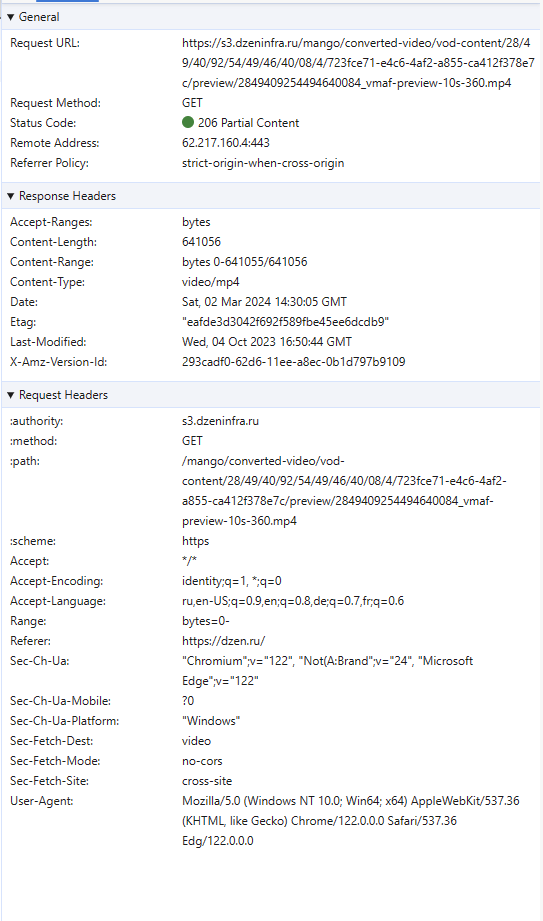
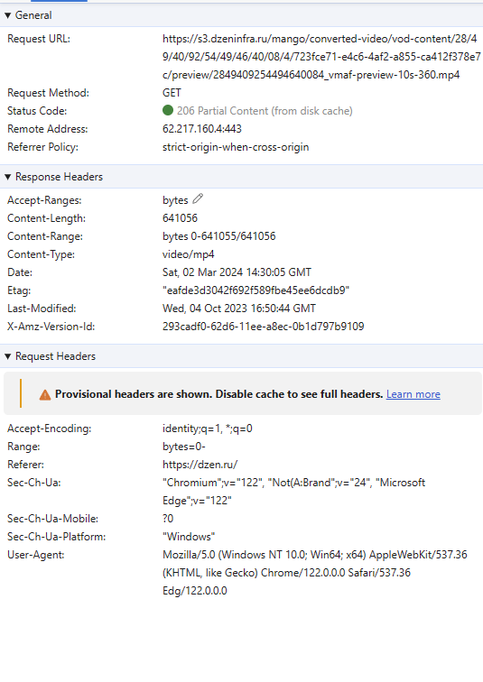
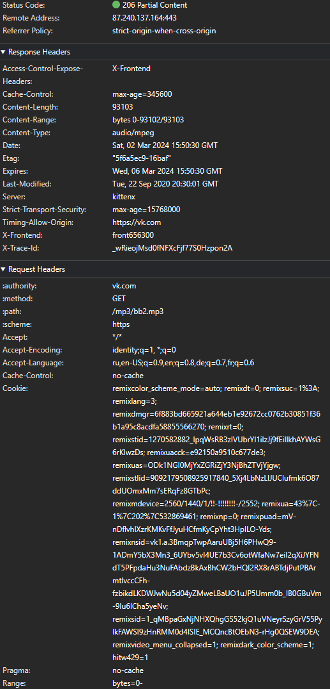
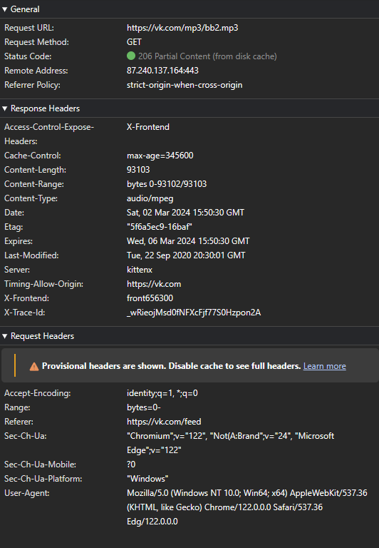

### Partial Content

Примеры применения частичного контента

- 

Видео превью - dzen.ru

  

  Инициализирующий (не кэшированный) ответ

   -

  Кешированный ответ

  

  

  

- 

Аудио файл - vk.com

  

  Не понятно зачем его отправили именно так, так как аудио файлы маленькие.

  Инициализирующий (не кэшированный) ответ

   -

  Кешированный ответ

  

  

  

- 

Видео, которое разбито по байтам - pinterest.com

  

  Инициализирующие (не кэшированные) ответы

  Первый не кешированный ответ
  

  N-number не кешированный ответ
  

  Последний не кешированный ответ
  

  Первый кешированный ответ
  

  N-number кешированный ответ
  

  Последний кешированный ответ
  

  

  

