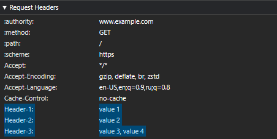

#

### URL

**Local scheme (локальная схема)** - это "about", "blob" или "data".

URL-адрес является локальным, если его схема является локальной схемой.

**HTTP(S) scheme** — «http» или «https».

**Fetch scheme** — это **local scheme**, "file" или **HTTP(S) scheme**.

## HTTP

### [Methods](https://fetch.spec.whatwg.org/#methods)

Методы, которые запрещены (**forbidden method**) для использования в Fetch API : `CONNECT`, `TRACE`.

Нормализация - это процесс приведения методов, к uppercase формату. Это делается Fetch API, так как методы на самом деле "чувствительны к регистру" (case-sensitive).

### [Headers](https://fetch.spec.whatwg.org/#terminology-headers)

HTTP обычно называет заголовок «полем» (**field**) или «полем заголовка» (**header field**). Веб-платформа использует более разговорный термин «заголовок».

Если при отправки сообщения встречаются поля с одинаковым названием, то их значения комбинируются в одно поле.

В **Fetch API** заголовки сортируются по возрастанию. Источник: https://fetch.spec.whatwg.org/#concept-header-list-sort-and-combine

<details>
<summary>Пример сортировкой заголовков и комбинирования полей:</summary>
<p>

```javascript
// Заголовки, которые пойдут потом пойдут в fetch

const headers = new Headers([
  ["Header-1", "value 1"],
  ["Header-3", "value 3"],
  ["Header-2", "value 2"],
  ["Header-3", "value 4"],
]);
```
Получаемый результат будет такой:



</p>
</details>

### [Forbidden request-header](https://fetch.spec.whatwg.org/#forbidden-request-header)

Это поля считаются запрещенными, так что их нельзя добавить или изменить программно, поэтому пользовательский агент сохраняет полный контроль над ними.

- `Accept-Charset`
- `Accept-Encoding`
- `Access-Control-Request-Headers`
- `Access-Control-Request-Method`
- `Connection`
- [`Content-Length`](https://www.rfc-editor.org/rfc/rfc9110#name-content-length)
- `Cookie`
- `Cookie2`
- `Date`
- `DNT`
- `Expect`
- `Host`
- `Keep-Alive`
- `Origin`
- `Referer`
- `TE`
- `Trailer`
- `Transfer-Encoding`
- `Upgrade`
- `Via`
- `Set-Cookie`
- `Proxy-`
- `Sec-`

### [Forbidden response-header name](https://fetch.spec.whatwg.org/#forbidden-response-header-name)
- `Set-Cookie`
- `Set-Cookie2`


## [Statuses](https://fetch.spec.whatwg.org/#statuses)

**Fetch API** работает только со статусами в диапазоне от 0 до 999

**Fetch API** разделяет статусы на категории:
- [**null body status**](https://fetch.spec.whatwg.org/#null-body-status) - статусы `101`, `103`, `204`, `205`, `304`.
- [**ok status**](https://fetch.spec.whatwg.org/#ok-status) - статусы диапазона от 200 до 299
- [**redirect status**](https://fetch.spec.whatwg.org/#redirect-status) - статусы `301`, `302`, `303`, `307`, `308`.

## Requests

[**Response tainting**](https://fetch.spec.whatwg.org/#concept-request-response-tainting) - это механизм, который определяет, какие типы запросов могут быть выполнены через веб-страницы, и какие типы ответов доступны скриптам после выполнения этих запросов. Это связано с политикой одного происхождения (same-origin policy), которая предотвращает доступ к ресурсам с других происхождений без явного разрешения.

В контексте **Fetch API**, “tainting” используется для управления доступом к ответам на запросы, которые были сделаны к другим происхождениям. Вот основные моменты:

- **opaque (no-cors)**: Этот режим используется для запросов к ресурсам другого происхождения, где ответы будут “запятнаны” (**tainted**) и не доступны скриптам. Это означает, что JavaScript не сможет прочитать содержимое ответа, и такие ответы имеют статус “opaque” в терминах Fetch API.
- **cors**: Если запрос выполняется в режиме “cors”, то ответ может быть доступен скриптам, при условии, что сервер на другом происхождении разрешает такой доступ с помощью CORS заголовков.
- **basic (default)**: Если запрос и ответ происходят в рамках одного и того же происхождения, то ответ не будет “запятнан” и полностью доступен скриптам.

## Responses

У **Fetch API** есть механизм/концепция, который ограничивает/фильтрует получаемые поля и контент исходя из [связанного с ответом типа](https://fetch.spec.whatwg.org/#concept-response-type) и разрешенных/запрещенных для передачи полей. Подробнее: [concept-filtered-response](https://fetch.spec.whatwg.org/#concept-filtered-response)


## Fields

### [Origin 📂](../topics/web-origin.md) 🎩➡️

Поле `Origin` добавляется к запросу, в некоторых случаях:
- Когда ожидается, что ответ будет помечен как ‘загрязненный’ ([**response tainting**](https://fetch.spec.whatwg.org/#concept-request-response-tainting)) согласно режиму `cors`.
- Если режим запроса (mode) установлен как `websocket`. Этот режим автоматически устанавливается только при работе с [WebSocket API](https://websockets.spec.whatwg.org/).
- Когда метод запроса отличается от `GET` или `HEAD`, наличие поля **`Origin`** в запросе зависит от того, противоположен ли режим (mode) `cors` и от политики отправителя (`referrer policy`).

Подробнее про добавление поля в сообщение запроса можно прочитать в спецификации: https://fetch.spec.whatwg.org/#append-a-request-origin-header


### [X-Content-Type-Options](https://fetch.spec.whatwg.org/#x-content-type-options-header) 🎩⬅️
**`X-Content-Type-Options`** - это поле использоваться для указания того, что следует следовать типам **MIME**, объявленным в заголовках `Content-Type`, и не изменять их. Поле принимает только одно значение `nosniff`.

### [Cross-Origin-Resource-Policy](https://fetch.spec.whatwg.org/#cross-origin-resource-policy-header) 🎩⬅️
**`Cross-Origin-Resource-Policy`** - это поле передает пожелание, чтобы браузер (user agent) блокировал запросы `no-cors` cross-origin/cross-site к данному ресурсу.

Больше информации: [Consider deploying cross-origin resource policy!](https://resourcepolicy.fyi/)

// TODO: Вернуться сюда, когда прочитаю спецификацию по HTML, а если точнее, то эту часть [Loading web pages](https://html.spec.whatwg.org/multipage/browsers.html#browsers)


### [Sec-Purpose](https://fetch.spec.whatwg.org/#sec-purpose-header)
