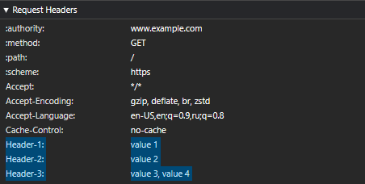

# Fetch

## Table of contents

- [Overview](#overview)
  - [URL](#url)
  - [HTTP](#http)
    - [Methods](#methods)
    - [Headers](#headers)
  - [Forbidden headers](#forbidden-headers)
    - [Forbidden request headers](#forbidden-request-headers)
    - [Forbidden response-header name](#forbidden-response-header-name)
  - [Statuses](#statuses)
- [Requests](#requests)
- [Responses](#responses)
- [Fields](#fields)
  - [Origin 📂 🎩➡️](#origin-)
  - [X-Content-Type-Options 🎩⬅️](#x-content-type-options)
  - [Cross-Origin-Resource-Policy 🎩⬅️](#cross-origin-resource-policy)
  - [Sec-Purpose 🎩➡️](#sec-purpose)

## Overview

### URL

Локальная схема ([*local scheme*](https://fetch.spec.whatwg.org/#local-scheme)) - это "about", "blob" или "data".

URL-адрес является локальным, если его схема является локальной схемой.

**HTTP(S) scheme** — "http" или "https".

**Fetch scheme** — это [local scheme](https://fetch.spec.whatwg.org/#local-scheme), "file" или **HTTP(S) scheme**.

Для каждого типа, который есть в fetch scheme, есть дополнительные шаги, для алгоритма основного запроса ([*main fetch*](https://fetch.spec.whatwg.org/#concept-main-fetch)), которые определены в алгоритме [scheme-fetch](https://fetch.spec.whatwg.org/#concept-scheme-fetch).

### HTTP

#### [Methods](https://fetch.spec.whatwg.org/#methods)

Запрещенными методами ([*forbidden methods*](https://fetch.spec.whatwg.org/#forbidden-method)) для использования в Fetch API являются: [`CONNECT`](https://www.rfc-editor.org/rfc/rfc9110#section-9.3.6), [`TRACE`](https://www.rfc-editor.org/rfc/rfc9110#section-9.3.8), `TRACK`.

Все методы в Fetch API проходят нормализацию ([*normalization*](https://fetch.spec.whatwg.org/#concept-method-normalize)), так называется процесс приведения методов, к [byte-uppercase](https://infra.spec.whatwg.org/#byte-uppercase) формату. Нормализация методов выполняется для обеспечения обратной совместимости (*backwards compatibility*) и согласованности (*consistency*) между API, поскольку методы на самом деле "чувствительны к регистру" (*case-sensitive*).

[Normalization](https://fetch.spec.whatwg.org/#concept-method-normalize) is done for backwards compatibility and consistency across APIs as [methods](https://fetch.spec.whatwg.org/#concept-method) are actually "case-sensitive".

[Подробнее про HTTP методы можно узнать здесь 📂](../../../topics/methods/readme.md).

#### [Headers](https://fetch.spec.whatwg.org/#terminology-headers)

HTTP обычно называет заголовок «полем» (*field*) или «полем заголовка» (*header field*). Веб-платформы используют более разговорный термин «заголовок» (*header*).

Если при отправки сообщения встречаются поля с одинаковым названием, то их значения комбинируются в одно поле, так же заголовки сортируются по возрастанию. [^1]

<details>
<summary>Пример сортировки и комбинирования заголовков</summary>
<p>

```javascript
// Заголовки, которые пойдут потом пойдут в fetch

const headers = new Headers([
  ["Header-1", "value 1"],
  ["Header-3", "value 3"],
  ["Header-2", "value 2"],
  ["Header-3", "value 4"], // Повторяет название существующего заголовка
]);
```

Получаемый результат будет такой:



</p>
</details>

### [Forbidden headers](https://fetch.spec.whatwg.org/#forbidden-request-header)

Запрещенные заголовки, это те заголовки, которые нельзя программно, через Fetch API получить с ответом или добавить в запросом. Они запрещены, поэтому пользовательский агент сохраняет полный контроль над ними.

#### [Forbidden request headers](https://fetch.spec.whatwg.org/#forbidden-request-header)

Перечисленные ниже поля заголовков считаются запрещенными для запросов (*request*), так что их нельзя добавить или изменить программно, через API.

<details>
<summary>Forbidden request headers</summary>

К запрещенным заголовкам запроса, относятся:

- `Accept-Charset`
- `Accept-Encoding`
- [`Access-Control-Request-Headers`](https://fetch.spec.whatwg.org/#http-access-control-request-headers)
- [`Access-Control-Request-Method`](https://fetch.spec.whatwg.org/#http-access-control-request-method)
- `Connection`
- [`Content-Length`](https://www.rfc-editor.org/rfc/rfc9110#name-content-length)
- `Cookie`
- `Cookie2`
- `Date`
- `DNT`
- `Expect`
- `Host`
- `Keep-Alive`
- [`Origin`](https://fetch.spec.whatwg.org/#http-origin)
- `Referer`
- `TE`
- `Trailer`
- `Transfer-Encoding`
- `Upgrade`
- `Via`
- `Set-Cookie`
- `Proxy-`
- `Sec-`

> [!NOTE]
> К частично запрещенным заголовкам запроса, относятся:
>
> - `X-HTTP-Method`
> - `X-HTTP-Method-Override`
> - `X-Method-Override`
>
> Эти заголовки могут стать запрещенными, если в них будет передан запрещенный метод ([*forbidden method*](https://fetch.spec.whatwg.org/#forbidden-method)).
> Подробнее в пункте 3 алгоритма [forbidden-request-header](https://fetch.spec.whatwg.org/#forbidden-request-header)

</details>

#### [Forbidden response-header name](https://fetch.spec.whatwg.org/#forbidden-response-header-name)

К запрещенным заголовкам ответа, относятся:

- `Set-Cookie`
- `Set-Cookie2`

> [!IMPORTANT]
> Хотя, поле `Set-Cookie` считается запретным для ответа, на сервере, передаваемые этим полем файлы куки, можно получить через метод [`getSetCookie()`](https://fetch.spec.whatwg.org/#dom-headers-getsetcookie).
> Так же файлы куки передаваемые через поле заголовка `Set-Cookie` в конструкторе [`new Headers`](https://fetch.spec.whatwg.org/#dom-headers), можно получить через метод [`getSetCookie()`](https://fetch.spec.whatwg.org/#dom-headers-getsetcookie)

```javascript
const headers = new Headers({
  "Set-Cookie": "name1=value1",
});

headers.append("Set-Cookie", "name2=value2");

headers.getSetCookie();
```

### [Statuses](https://fetch.spec.whatwg.org/#statuses)

Fetch API работает только со статусами в диапазоне от 0 до 999

Fetch API разделяет статусы на категории:

- [**null body status**](https://fetch.spec.whatwg.org/#null-body-status) - статусы `101`, `103`, `204`, `205`, `304`.
- [**ok status**](https://fetch.spec.whatwg.org/#ok-status) - статусы диапазона от 200 до 299
- [**redirect status**](https://fetch.spec.whatwg.org/#redirect-status) - статусы `301`, `302`, `303`, `307`, `308`.

## Requests

> [!TIP]
> Вкратце про настройку запросов можно прочитать в секции [Setting up a request](https://fetch.spec.whatwg.org/#fetch-elsewhere-request)

Каждый запрос (*request*) имеет связанный с ним тип инициатора ([*initiator-type*](https://fetch.spec.whatwg.org/#request-initiator-type)), который является:

<details>
<summary>Полный список инициирующих запрос типов</summary>

- null (**default**)
- `"beacon"` - если запрос является результатом обработки (*processing*) методом [`sendBeacon()`](https://www.w3.org/TR/beacon/#dom-navigator-sendbeacon)
- `"body"`
- `"css"` - если запрос является результатом обработки директивы CSS [`url()`](https://www.w3.org/TR/css-values-4/#funcdef-url), такой как `@import url()` или `background: url()`;
- `"early-hints"`
- `"embed"`
- `"fetch"` - если запрос является результатом обработки (*processing*) методом [`fetch()`](https://fetch.spec.whatwg.org/#dom-global-fetch).
- `"xmlhttprequest"` - если запрос является результатом обработки (*processing*) [`XMLHttpRequest`](https://xhr.spec.whatwg.org/#xmlhttprequest).
- `"font"`
- `"frame"` - если запрос является результатом загрузки (*loading*) устаревшего (*obsolete*) элемента [`<frame>`](https://html.spec.whatwg.org/multipage/obsolete.html#frame).
- `"iframe"` - если запрос является результатом обработки аттрибута [`src`](https://html.spec.whatwg.org/multipage/iframe-embed-object.html#attr-iframe-src) элемента [`<iframe>`](https://html.spec.whatwg.org/multipage/iframe-embed-object.html#the-iframe-element)
- `"img"` - если запрос является результатом обработки (*processing*) аттрибутов [`src`](https://html.spec.whatwg.org/multipage/embedded-content.html#attr-img-src) или [`srcset`](https://html.spec.whatwg.org/multipage/embedded-content.html#attr-img-srcset) элемента [``](https://html.spec.whatwg.org/multipage/embedded-content.html#the-img-element).
- `"image"` - если запрос является результатом обработки (*processing*) SVG элемента [`<image>`](https://www.w3.org/TR/SVG2/embedded.html#ImageElement).
- `"input"` - если запрос является результатом обработки (*processing*) элемента [`<input>`](https://html.spec.whatwg.org/multipage/input.html#the-input-element)`element of`[type](https://html.spec.whatwg.org/multipage/input.html#attr-input-type) с аттрибутом [`type`](https://html.spec.whatwg.org/multipage/input.html#attr-input-type) в значении [image](https://html.spec.whatwg.org/multipage/input.html#attr-input-type-image-keyword) (т.е. `<input type="image" />`)
- `"a"` - если запрос является результатом обработки (*processing*) элемента [`<a>`](https://html.spec.whatwg.org/multipage/text-level-semantics.html#the-a-element) и его аттрибутов [`download`](https://html.spec.whatwg.org/multipage/links.html#attr-hyperlink-download) или [`ping`](https://html.spec.whatwg.org/multipage/links.html#ping).
- `"link"`
- `"object"`
- `"ping"`
- `"script"` - если запрос является результатом загрузки любого [скрипта](https://html.spec.whatwg.org/multipage/#concept-script) (классического [`script`](https://html.spec.whatwg.org/multipage/scripting.html#script), [module script](https://html.spec.whatwg.org/multipage/webappapis.html#module-script) или [`Worker`](https://html.spec.whatwg.org/multipage/workers.html#worker)).
- `"video"` - если запрос является результатом обработки аттрибутов [`poster`](https://html.spec.whatwg.org/multipage/media.html#attr-video-poster) или [`src`](https://html.spec.whatwg.org/multipage/media.html#attr-media-src) элемента [`<video>`](https://html.spec.whatwg.org/multipage/media.html#video).
- `"audio"` - если запрос является результатом обработки (*processing*) аттрибута [`src`](https://html.spec.whatwg.org/multipage/media.html#attr-media-src) элемента [`<audio>`](https://html.spec.whatwg.org/multipage/media.html#audio).
- `"track"` - если запрос является результатом обработки (*processing*) аттрибута [`src`](https://html.spec.whatwg.org/multipage/media.html#attr-media-src) элемента [`<track>`](https://html.spec.whatwg.org/multipage/media.html#the-track-element).
- `"navigation"` - если запрос является навигационным ([*navigation request*](https://fetch.spec.whatwg.org/#navigation-request));
- `"other"`, если ни одно из вышеуказанных условий не соответствует.

> [!NOTE]
> Источники: [HTML Spec](https://fetch.spec.whatwg.org/#request-initiator-type), [Resource Timing](https://w3c.github.io/resource-timing/#issue-container-generatedID-0)

</details>

Так же каждый запрос имеет соответствующего инициатора (initiator), который представляет собой пустую строку (default), "`download`", "`imageset`", "`manifest`", "`prefetch`", "`prerender`", или "`xslt`"

Так же каждый запрос имеет связанный пункт назначения ([*destination*](https://fetch.spec.whatwg.org/#concept-request-destination)), который представляет собой пустую строку (default) , "`audio`", "`audioworklet`", "`document`", "`embed`", "`font`", "`frame`", "`iframe`", "`image`", "`json`", "`manifest`", "`object`", "`paintworklet`", "`report`", "`script`", "`serviceworker`", "`sharedworker`", "`style`", "`track`", "`video`", "`webidentity`", "`worker`", или "`xslt`".

> [!NOTE]
> Есть хорошая таблица, которая иллюстрирует взаимосвязь между инициатором запроса ([*initiator*](https://fetch.spec.whatwg.org/#concept-request-initiator)), его назначением [*destination*](https://fetch.spec.whatwg.org/#concept-request-destination), [директивами Content Security Policy](https://w3c.github.io/webappsec-csp/#csp-directives) и разными фичами.
>
> <https://fetch.spec.whatwg.org/#destination-table>

table illustrates the relationship between a [request](https://fetch.spec.whatwg.org/#concept-request)'s [initiator](https://fetch.spec.whatwg.org/#concept-request-initiator), [destination](https://fetch.spec.whatwg.org/#concept-request-destination), CSP directives, and features.

### Response tainting

[**Response tainting**](https://fetch.spec.whatwg.org/#concept-request-response-tainting) - это механизм который определяет, какие типы запросов могут быть выполнены через веб-страницы, и какие типы ответов доступны скриптам после выполнения этих запросов. Это связано с политикой одного происхождения (*same-origin policy*), которая предотвращает доступ к ресурсам с других происхождений без явного разрешения.

В контексте Fetch API, “tainting” используется для управления доступом к ответам на запросы, которые были сделаны к другим происхождениям. Вот основные моменты:

- **opaque (no-cors)**: Этот режим используется для запросов к ресурсам другого происхождения, где ответы будут “запятнаны” (**tainted**) и не доступны скриптам. Это означает, что JavaScript не сможет прочитать содержимое ответа, и такие ответы имеют статус “opaque” в терминах Fetch API.
- **cors**: Если запрос выполняется в режиме “cors”, то ответ может быть доступен скриптам, при условии, что сервер на другом происхождении разрешает такой доступ с помощью CORS заголовков.
- **basic (default)**: Если запрос и ответ происходят в рамках одного и того же происхождения, то ответ не будет “запятнан” и полностью доступен скриптам.

## Responses

У Fetch API есть механизм/концепция, который ограничивает/фильтрует получаемые поля и контент исходя из [связанного с ответом типа](https://fetch.spec.whatwg.org/#concept-response-type) и разрешенных/запрещенных для передачи полей. Подробнее: [concept-filtered-response](https://fetch.spec.whatwg.org/#concept-filtered-response)

## Fields

### [Origin 📂](../topics/origin.md)

Поле **`Origin`** (🎩➡️) добавляется к запросу, в некоторых случаях:

- Когда ожидается, что ответ будет помечен как "загрязненный" ([*response tainting*](https://fetch.spec.whatwg.org/#concept-request-response-tainting)) согласно режиму `cors`.
- Если режим запроса ([*request mode*](https://fetch.spec.whatwg.org/#concept-request-mode)) установлен как `websocket`. Этот режим автоматически устанавливается только при работе с [WebSocket API](https://websockets.spec.whatwg.org/).
- Когда метод запроса отличается от `GET` или `HEAD`, наличие поля **`Origin`** в запросе зависит от того, противоположен ли режим (mode) `cors` и от политики отправителя (`referrer policy`).

Подробнее про добавление поля в сообщение запроса можно прочитать в алгоритме [append a request `Origin` header](https://fetch.spec.whatwg.org/#append-a-request-origin-header).

### [X-Content-Type-Options](https://fetch.spec.whatwg.org/#x-content-type-options-header)

**`X-Content-Type-Options`** (🎩⬅️) - это поле использоваться для указания того, что следует следовать типам **MIME**, объявленным в заголовках `Content-Type`, и не изменять их. Поле принимает только одно значение `nosniff`.

### [Cross-Origin-Resource-Policy](https://fetch.spec.whatwg.org/#cross-origin-resource-policy-header)

**`Cross-Origin-Resource-Policy`** (🎩⬅️) - это поле передает пожелание, чтобы браузер (*user agent*) блокировал запросы `no-cors` cross-origin/cross-site к данному ресурсу.

Больше информации: [Consider deploying cross-origin resource policy!](https://resourcepolicy.fyi/)

### [Sec-Purpose](https://fetch.spec.whatwg.org/#sec-purpose-header)

**`Sec-Purpose`** (🎩➡️) - это поле запроса указывает, что запрос служит одной или нескольким целям, отличным от запроса ресурса для немедленного использования пользователем.

Это поле передает только один токен `prefetch`, который указывает на то, что целью запроса является получение ресурса, который, как ожидается, понадобится в ближайшее время.

## Fetch API

### [Headers class](https://fetch.spec.whatwg.org/#headers-class)

Создает новый объект [`Headers`](https://fetch.spec.whatwg.org/#headers).

### [Request class](https://fetch.spec.whatwg.org/#request-class)

Создает новый объект запроса [`Request`](https://fetch.spec.whatwg.org/#dom-request).

Если в качестве аргумента input для конструктора `new Request(input, initialOptions)` предается строка:

- то по умолчанию [request mode](https://fetch.spec.whatwg.org/#dom-request-mode) использует значение `"cors"`. Настроить request mode можно через опцию [`mode`](https://fetch.spec.whatwg.org/#dom-requestinit-mode), которую можно добавить в запрос.
- то по умолчанию [request credentials mode](https://fetch.spec.whatwg.org/#concept-request-credentials-mode) использует значение `"same-origin"`. Настроить [request credentials mode](https://fetch.spec.whatwg.org/#concept-request-credentials-mode) можно через опцию [`credentials`](https://fetch.spec.whatwg.org/#dom-requestinit-credentials), которую можно добавить в запрос.

If input is a string, it defaults to "same-origin".

### [Response class](https://fetch.spec.whatwg.org/#response-class)

### [Fetch method](https://fetch.spec.whatwg.org/#fetch-method)

[^1]: <https://fetch.spec.whatwg.org/#concept-header-list-sort-and-combine>
