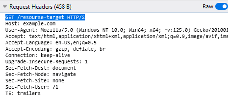
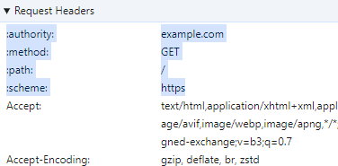
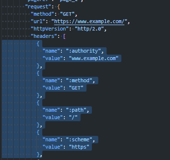

# Messages

## [Message Framing](https://www.rfc-editor.org/rfc/rfc9110#name-framing-and-completeness)

Фрейминг сообщения (**message framing**) указывает, на то как начинается и заканчивается каждое сообщение (**message**), так что каждое сообщение можно отличить от других сообщений или помех в том же соединении.

Каждая основная версия HTTP определяет свой собственный механизм фрейминга.

Сообщение считается *«полным»*, когда все октеты, указанные в его кадре (**framing**), доступны.

___

## [Message](https://www.rfc-editor.org/rfc/rfc9110#section-6)

**Сообщение (*message*)** состоит из **control data**, **headers fields**, **content**.

### [Control data](https://www.rfc-editor.org/rfc/rfc9110#section-6.2)

**Control data** - это описание и путь/направление сообщения. Описывает то, что получатель должен знать немедленно.

- Для запросов (*request*) **control data** будет состоять из:  метода (method), цели запроса (request target), версии HTTP протокола.
- Для ответов (*response*) **control data** будет состоять из: статуса (status code), опциональной фраза о причине, версии HTTP протокола

> [!NOTE]
> Существуют различия в том как **control data** передается в сообщениях в зависимости от версии протокола
>
> 

> 
Подробнее про различия

> 

>
> В HTTP/1.1 и более ранних протоколах **control data** отправляются в виде первой строки сообщения.
>  ___
>
> 
>
> В HTTP/2 и HTTP/3 **control data** передаются как *pseudo-header* поля с зарезервированными именными префиксами >(например, ":authority")
>
>  ___
>
> 
>
> 
>
> 

> 

### [Headers fields](https://www.rfc-editor.org/rfc/rfc9110#section-6.3)

**Headers fields** используются для расширения **control data** и передачи дополнительной информации об отправителе, сообщении, содержимом или контексте. Описывает, что необходимо знать перед получением контента.

### [Content](https://www.rfc-editor.org/rfc/rfc9110#section-6.4)

**Content** - это контент/данные, который пересылают друг другу client и server. Контент может полным, частичным ([**partial content**](./partial-content.md) 📂) или пустым (т.е. отсутствовать) представлением ресурса.

### [Trailers fields](https://www.rfc-editor.org/rfc/rfc9110#section-6.5)

- **Trailers fields** используются для передачи информации, полученной при отправке контента. Содержаться необязательные метаданные, которые были неизвестны до отправки содержимого
- **Trailers fields** могут быть полезны для предоставления проверки целостности сообщений, цифровых подписей, показателей доставки или информации о состоянии последующей обработки. [Источник](https://www.rfc-editor.org/rfc/rfc9110#section-6.5-1)

<!-- TODO: Изучить для чего это могут быть полезны trailer fields и как их применять -->

___

Сообщения с одинаковыми названиями должны не записываться в несколько строк поля с (будь то в заголовках (**header**) или трейлерах) или добавлять строку поля, когда строка поля с таким же именем уже существует в сообщении, так как порядок, в котором принимаются строки поля с одинаковым именем, имеет значение для интерпретации значения поля.

> [!NOTE]
> Но есть одно исключение: `Set-Cookie`
>
> [Источник](https://www.rfc-editor.org/rfc/rfc9110#section-5.3)

Порядок, в котором строки полей с разными именами полей принимаются не является существенным. Но существуют рекомендации.

<!-- TODO: Найти рекомендации по порядку в котором принимаются заголовки HTTP сообщений -->

> [!NOTE]
> Firefox DevTools позволяет посмотреть порядок строк в HTTP сообщениях (есть кнопка переключения, которая называется "raw"), в свою очередь Chrome DevTools, такой возможностью не обладают.

<!-- TODO: Проверить настройки Chrome DevTools, на наличие опции просмотра порядка передаваемых заголовков в HTTP сообщениях

Firefox DevTools позволяет посмотреть порядок строк в HTTP сообщениях (есть кнопка переключения, которая называется "raw"), в свою очередь Chrome DevTools, такой возможностью не обладают.
-->
