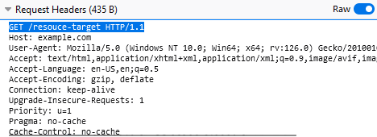
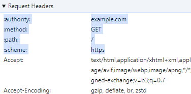
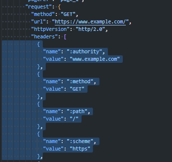
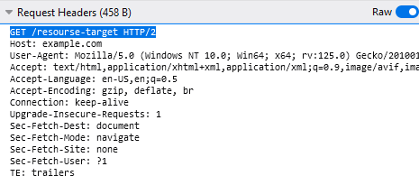

# Examples of HTTP control data

## Table of contents

- [Control data with HTTP/1.1](#control-data-with-http11)
- [Control data with HTTP/2 and HTTP/3](#control-data-with-http2-and-http3)

### Control data with HTTP/1.1

|  |
| :----------------------------------------------------------------------------: |
|                    *HTTP/1.1 (Firefox DevTools screenshot)*                    |

### Control data with HTTP/2 and HTTP/3

|  |
| :----------------------------------------------------------------------: |
|                  *HTTP/2 (Chrome DevTools screenshot)*                   |

|  |
| :--------------------------------------------------------------------------------------: |
|                 *HTTP/2 Opened HAR file (Visual Studio Code screenshot)*                 |

> [!NOTE]
> В Firefox DevTools можно просматривать **control data** HTTP сообщений в первой строки сообщения, даже для протоколах, которые выше HTTP/1.1.
>
> Пример ниже.

|  |
| :--------------------------------------------------------------------------: |
|                    *HTTP/2 (Firefox DevTools screenshot)*                    |
