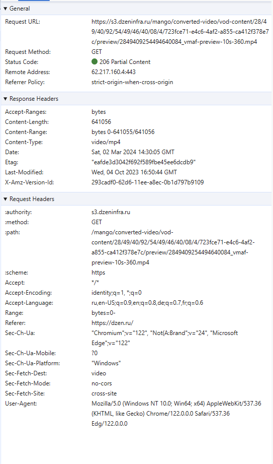
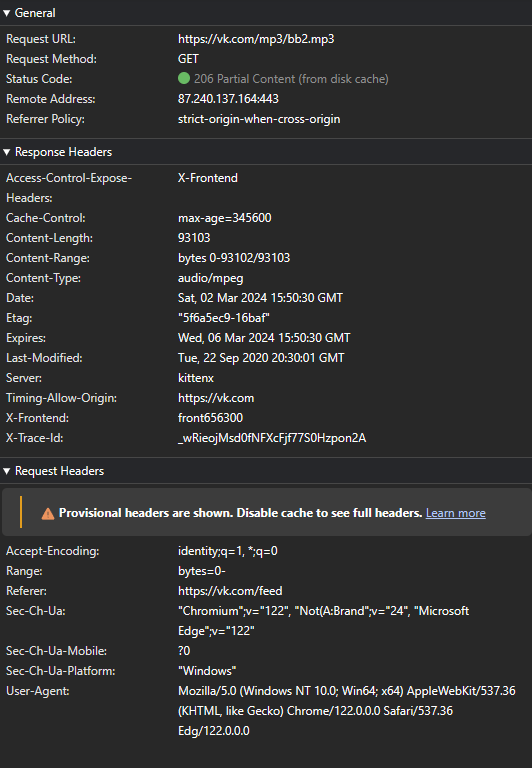
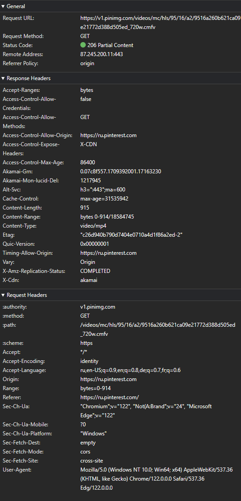
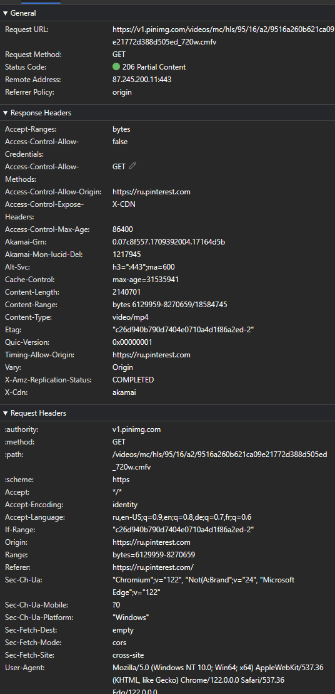
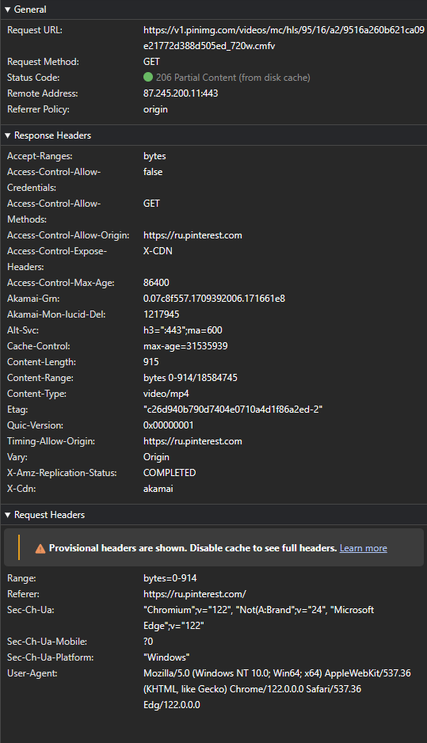
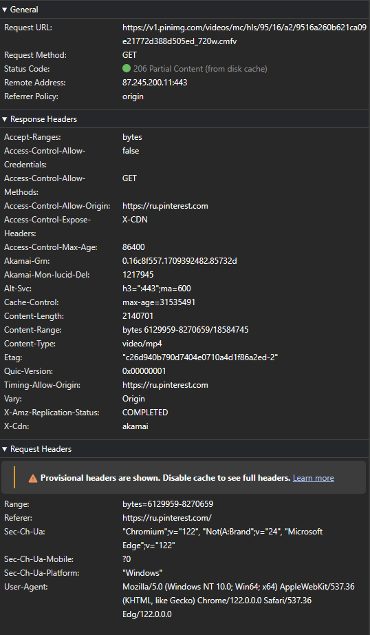
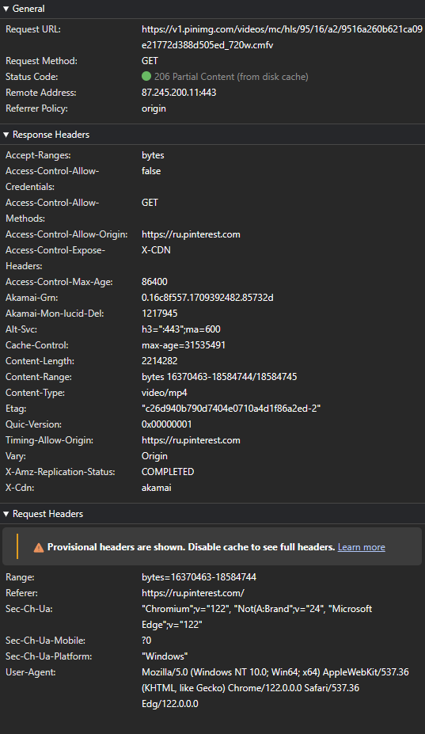

# Examples of Partial Content (Range Requests) usage

## Table of contents

- [Example 1 (dzen)](#example-1-dzen)
- [Example 2 (vk)](#example-2-vk)
- [Example 3 (pinterest)](#example-3-pinterest)

### Example 1 (dzen)

Видео превью.

Инициализирующий (не кэшированный) ответ

**Source**: <https://dzen.ru/>

 -

Кешированный ответ

### Example 2 (vk)

Аудио файл.

Инициализирующий (не кэшированный) ответ.

**Source**: <https://vk.com>

 -

Кешированный ответ

<!-- Не понятно зачем его отправили именно так, так как аудио файлы маленькие. -->

### Example 3 (pinterest)

Видео, разбитое по байтам.

**Source**: <https://pinterest.com/>

Первый не кешированный ответ

N-number не кешированный ответ

Последний не кешированный ответ

Первый кешированный ответ

N-number кешированный ответ

Последний кешированный ответ

