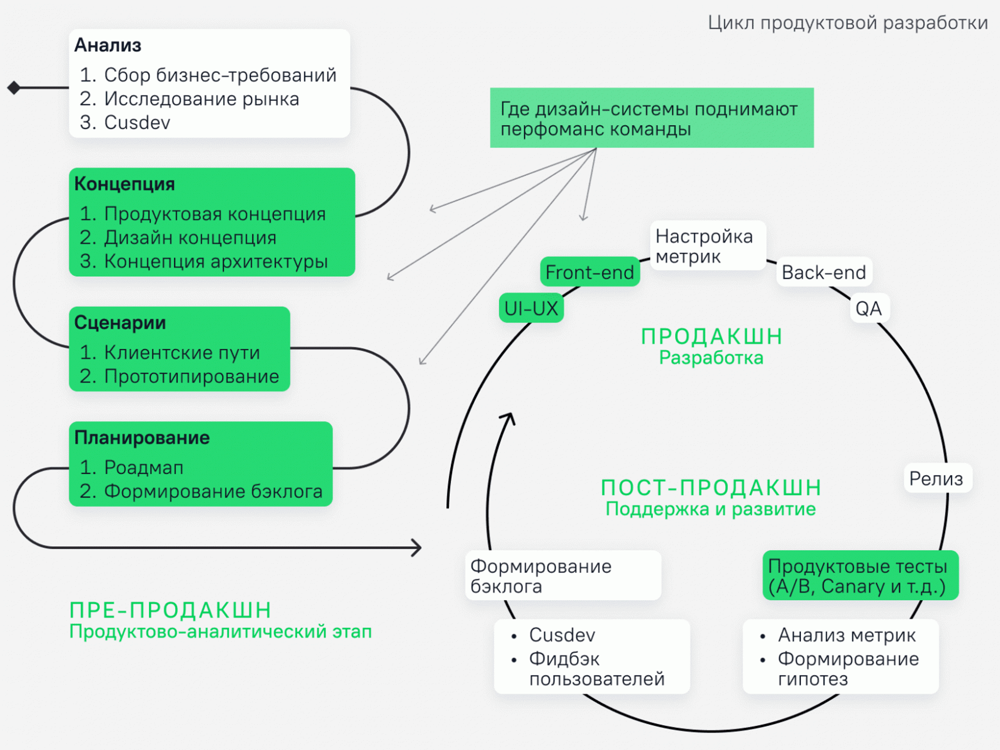
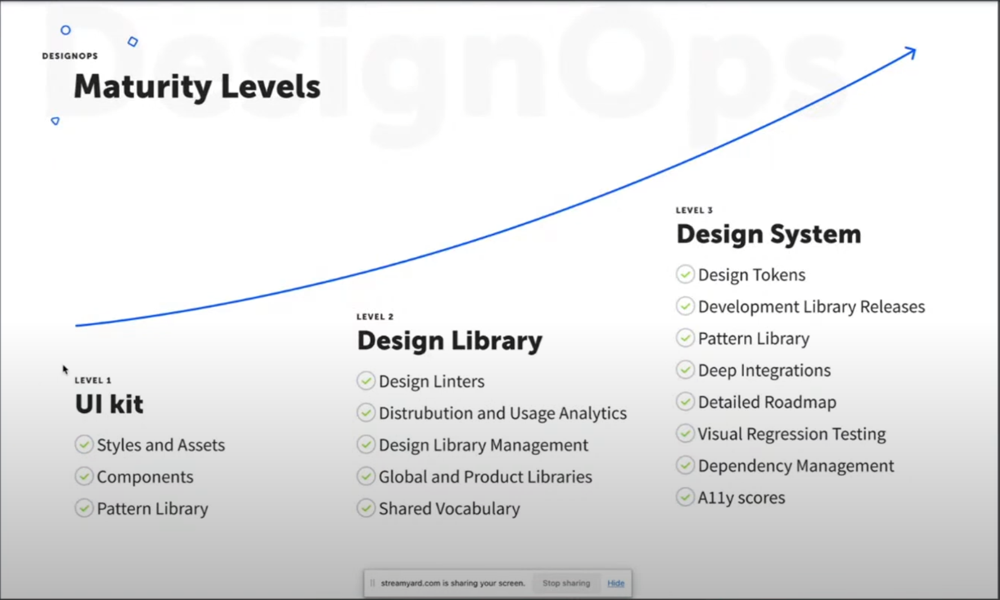

# Description

Шаги для построения дизайн системы:

- **Design Audit** (research).
Если продукт уже запущен, стоит выявить слабые, сильные и требующие внимания (доработки) стороны дизайна, которые могут влиять на поведение пользователя и останавливают его от конечного продуктового результата. Определить движение пользователя по продукту.
Сделать проверку на пригодность дизайна современным требованиям.
Может провести **Usability Testing.**
- Design
- Development
- Testing

Дизайн-система это любая визуальная и (не или) информационная система, состоящая из массива подобных друг другу элементов, объединённых общим логическим центром.

Дизайн система нужна для повышения эффективности команды продуктовой разработки, что позволяет ускорить разработку продукта и улучшить time to market для продукта.

Позволяет привлечь в разработку еще лиц, которые обычно не принимают участия в дизайне. Например, product manager может менять цвета или другие элементы, которые будут проверять те или иные продуктовые гипотезы.

По идее без продукта нет и дизайн системы. Есть только имитация.

## Quotes

> Дизайн-система — это набор инструментов и процессов, помогающий повысить скорость, качество, консистентность и предсказуемость результата для дизайна и фронтенда продукта
>
> Константин Зубанов - Команда дизайна Mail.ru

## Images

Цикл Продуктовой разработки

Maturity Levels

