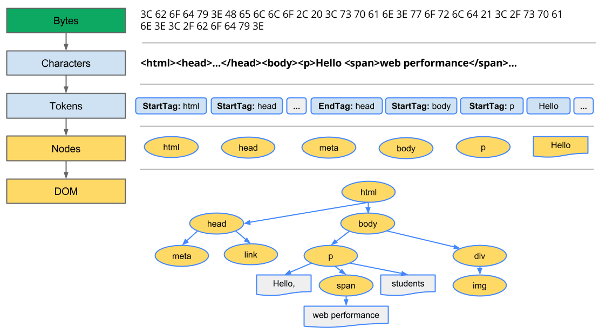
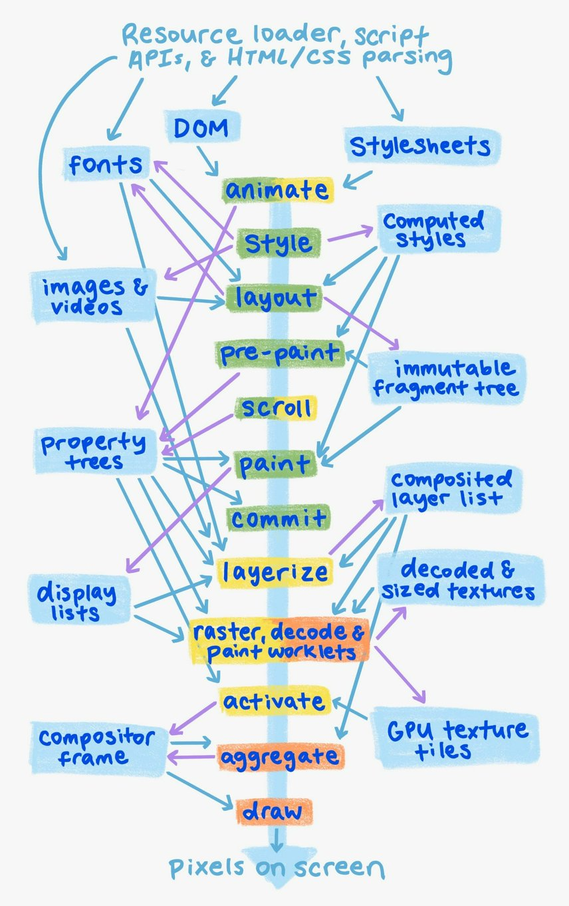

# Rendering path

## Materials

- [The Rendering Critical Path [chromium]](https://www.chromium.org/developers/the-rendering-critical-path/)
- [Understanding the critical path [web.dev]](https://web.dev/learn/performance/understanding-the-critical-path)
- [Critical Rendering Path [web.dev]](https://web.dev/articles/critical-rendering-path)
- [Overview of the RenderingNG architecture](https://developer.chrome.com/docs/chromium/renderingng-architecture)

## Overview

Критический путь рендеринга (*critical rendering path*) - это этапы, выполняемым до тех пор, пока веб-страница не начнет отображаться (*rendering*) в браузере. Для рендеринга страниц браузерам необходим сам HTML-документ, а также все критически важные ресурсы, необходимые для рендеринга этого документа.

Путь рендеринга (*rendering path*) включает в себя следующие шаги:

### [Rendering path v1](https://web.dev/articles/critical-rendering-path)

#### DOM

Построение объектной модели документа (DOM) на основе HTML.

> 
>
> Источник: <https://web.dev/articles/critical-rendering-path/constructing-the-object-model#document_object_model_dom>

Дерево DOM отображает свойства и взаимосвязи разметки документа, но не сообщает нам, как элемент будет выглядеть при визуализации. За это отвечает CSSOM.

#### CSSOM

Построение объектной модели CSS (CSSOM) на основе CSS.

Когда браузер создает DOM, он может обнаружить элемент `<link>` в разделе `<head>` документа, который ссылается на внешний CSS stylesheet: например, `style.css`. Предвидя, что ему понадобится этот ресурс для отображения страницы, он немедленно отправляет запрос на этот ресурс, который возвращается CSS файл, который в себе содержит стили.

Как и в случае с HTML, нам нужно преобразовать полученные правила CSS во что-то, что браузер может понимать и с чем он может работать. Следовательно, повторится процесс работы с HTML, но вместо этого используем CSS.

> 
>
> Источник: <https://web.dev/articles/critical-rendering-path/constructing-the-object-model#css_object_model_cssom>

#### JavaScript to DOM and CSSOM

Применение любого JavaScript, который изменяет DOM или CSSOM

#### Render tree

Построение дерева рендеринга на основе DOM и CSSOM

Дерево рендеринга (*render tree*) содержит только узлы, необходимые для рендеринга страницы.

1. Начиная с корня дерева DOM (*root of the DOM tree*), браузер проходится по каждому видимому узлу.
   - Некоторые узлы невидимы (например, теги сценариев, мета-теги и т.д.) и опущены, поскольку они не отражаются в выводимых результатах.
   - Некоторые узлы скрыты с помощью CSS и также отсутствуют в дереве рендеринга; например, через `display: none`
2. Для каждого видимого узла находится соответствующие правила CSSOM и применяют их.
3. Выпуск видимых узлов с содержимым и их вычисляемыми стилями.

#### Style

Выполнение операций со стилем

#### Layout

Layout подразумевает вычисление точного положения и размер каждого объекта.

#### Paint

Закрашивание (*paint*) пиксели элементов в памяти.

#### Composite

Объединение (*composite*) пиксели, если какие-либо из них перекрываются.

#### Display

Физически выведите все полученные пиксели на экран.

> 
>
> Источник: <https://web.dev/learn/performance/understanding-the-critical-path#the_critical_rendering_path>

### Rendering path v2

этапы конвейера
Потоки или процессы выполнения пути рендеринга:

- основной поток процесса рендеринга (**render process** *main thread*). Основной поток (*main thread*) запускает сценарии (*scripts*), цикл обработки событий рендеринга (*rendering event loop*), жизненный цикл документа, тестирование на соответствие требованиям, диспетчеризацию событий сценария и синтаксический анализ HTML, CSS и других форматов данных.
- компоновщик процесса рендеринга (*render process* ***compositor***)
- процесс viz (***viz*** *process*)

- Animate (анимация) - **render + compositor**: изменение вычисляемых стилей и видоизменение деревьев свойств (*property trees*) с течением времени на основе декларативных временных рамок.
- Style (Стиль) - **render**: применение CSS к DOM и создание вычисляемых стилей.
- Layout (Макет) - **render**: определяется размер и положение элементов DOM на экране и создается неизменяемое дерево фрагментов.
- Pre-paint (Предварительная раскраска) - **render**: вычисление деревья свойств (*property trees*) и, при необходимости, аннулирование всех существующих списков отображения и плитки текстур графического процессора (*GPU texture tiles*).
- Scroll (Прокрутка) - **render + compositor**: изменение смещения прокрутки документов и прокручиваемых элементов DOM, изменив деревья свойств.
- Paint - **render**: вычисление отображаемого списка, который описывает, как растрировать фрагменты текстур GPU из DOM.
- Commit - **render**: копирует деревья свойств (*property trees*) и список отображаемых объектов в поток compositor.
- Layerize - **compositor**: разделяется список отображаемых объектов на составной список слоев для независимой растеризации и анимации.
- Raster, decode and paint worklet - **compositor + viz**: преобразует отображаемые списки, закодированные изображения и код рабочей программы рисования, соответственно, в текстурные плитки графического процессора.
- Activate (активация) - **compositor**: создает рамку compositor, показывающую, как рисовать и размещать графические плитки на экране, а также любые визуальные эффекты.
- Aggregate - **viz**: объединяет фреймы compositor из всех видимых фреймов compositor в единый глобальный фрейм compositor.
- Draw (рисование) - **viz**: запускает агрегированный кадр compositor frame на графическом процессоре, чтобы создать пиксели на экране.

> 
>
> Источник: <https://developer.chrome.com/docs/chromium/renderingng-architecture>
